<p align="center">
  
</p>

<h1 align="center">Relic</h1>

<p align="center">
  <strong>Self-hosted artifact storage for developers.</strong><br>
  Paste it, share it, preview it — code, images, archives, PDFs, diagrams, anything.
</p>

<p align="center">
  <a href="https://github.com/ovidiuvio/relic/releases/latest">
    
  </a>
  <a href="LICENSE">
    
  </a>
  
  
  
</p>

<p align="center">
  <a href="#-quick-start"><b>🚀 Quick Start</b></a> ·
  <a href="#-features"><b>Features</b></a> ·
  <a href="#-visual-tour"><b>Screenshots</b></a> ·
  <a href="#-cli"><b>CLI</b></a> ·
  <a href="#-deployment"><b>Deployment</b></a>
</p>

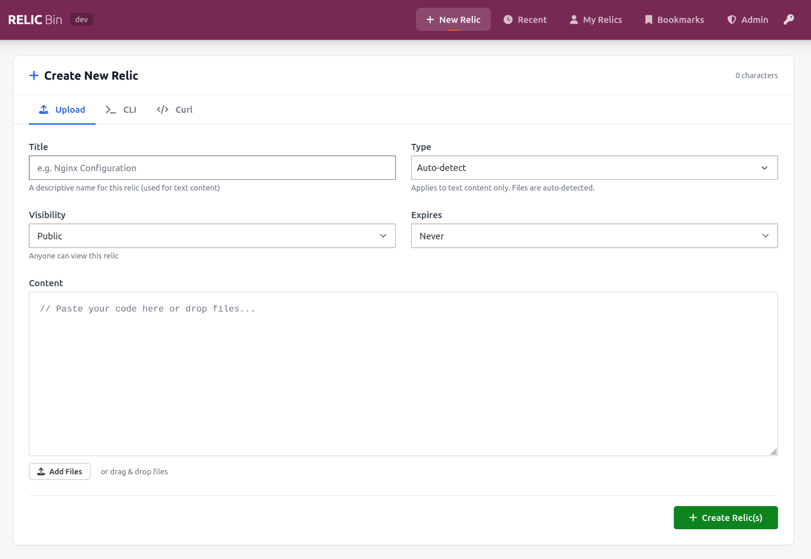

## Why Relic?

Most pastebins stop at text. Relic is built for everything developers actually share: it gives rich in-browser previews for code, images, archives, structured data, PDFs, spreadsheets, Markdown, and Excalidraw diagrams — all self-hosted on your own infrastructure with a single `docker compose up`.

Around that core, Relic adds the workflow pieces a team needs: fork a relic to build on someone else's snippet and diff it against the original, organize things into spaces, tag and bookmark what matters, and discuss it in comments — with public/private access, password protection, and expiration when you want them.

## 🚀 Quick Start

**Using prebuilt images** (recommended):

```bash
curl -O https://raw.githubusercontent.com/ovidiuvio/relic/main/deploy/docker-compose.yml
docker compose up -d
```

**Or from source:**

```bash
git clone https://github.com/ovidiuvio/relic.git
cd relic
make up
```

Then open **http://localhost**. That's it — no accounts, no configuration required to start pasting.

For production settings (passwords, version pinning, backups), see [`deploy/README.md`](deploy/README.md).

## ✨ Features

### 📦 Universal content support

- **Code** — Monaco editor and syntax highlighting for 100+ languages
- **Structured data** — interactive tree explorer for JSON, YAML, TOML, and XML
- **Archives** — browse ZIP/TAR contents in the browser, including previews of embedded files
- **Documents** — PDF rendering, CSV/Excel tables, Markdown rendering
- **Images & diagrams** — direct image previews and integrated Excalidraw support

### 🔀 Forks & diffs

- **Fork any relic** — build on someone else's snippet as an independent copy, with a `fork_of` reference back to the source
- **Lineage & diffs** — trace fork ancestry and visually compare additions/deletions between text relics

### 🗂️ Organize & discover

- **Spaces** — curated, dynamic collections with their own access controls and filtering
- **Tags & bookmarks** — label relics for search, bookmark the ones you care about
- **Relic indexes** — file-based curated collections (`.rix` files) that render as browsable tables

### 🔒 Sharing on your terms

- **Public or private** — public relics appear in recents; private ones are reachable only via their unguessable 128-bit URL
- **Password protection** — optional extra lock on any relic
- **Expiration** — from 10 minutes to never (the default)
- **Comments** — discuss code and artifacts directly on the relic page

### ⚡ Terminal-first workflow

- **Go CLI** — pipe from stdin, upload files, fork, list, and manage spaces without leaving the shell
- **Clean API** — everything the UI does is available under `/api/v1`, with interactive docs at `/docs`

### 🛡️ Built to operate

- **One-command deploy** — Docker Compose with Nginx, PostgreSQL, and MinIO included
- **Admin panel** — system stats, user management, content moderation
- **S3 sync** — optional periodic backup of object storage to any S3-compatible destination

## 📸 Visual Tour

<details>
<summary><b>📝 Rich code viewing</b> — syntax highlighting with line numbers, copy-to-clipboard, and raw view</summary>
<br>

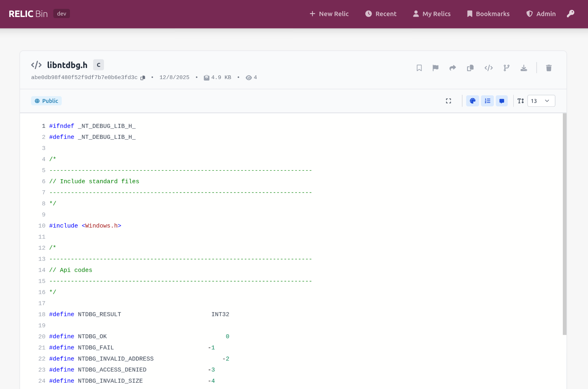
</details>

<details>
<summary><b>🔀 Diff viewer</b> — compare any relic against its fork, additions and deletions side by side</summary>
<br>

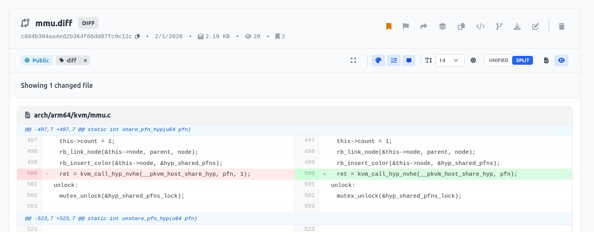
</details>

<details>
<summary><b>📦 Archive explorer</b> — browse ZIP/TAR contents without downloading</summary>
<br>

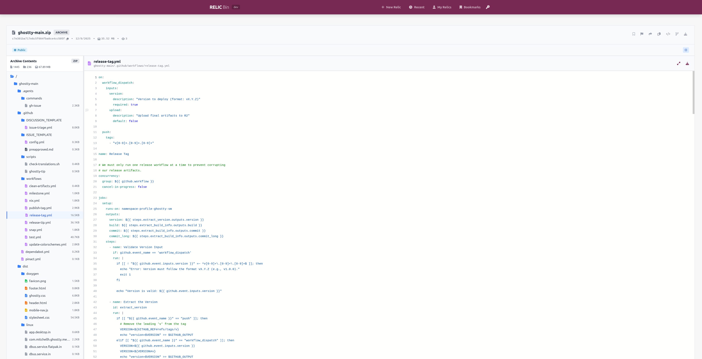
</details>

<details>
<summary><b>🌳 Structured data explorer</b> — navigate JSON, YAML, TOML, and XML as a tree</summary>
<br>

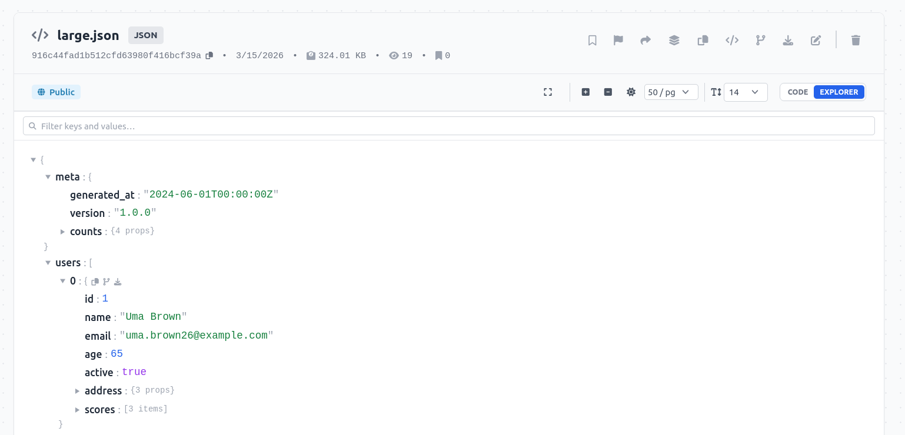
</details>

<details>
<summary><b>🗂️ Spaces</b> — curated collections with access controls, search, and filtering</summary>
<br>

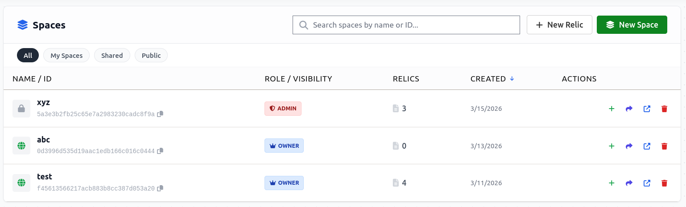
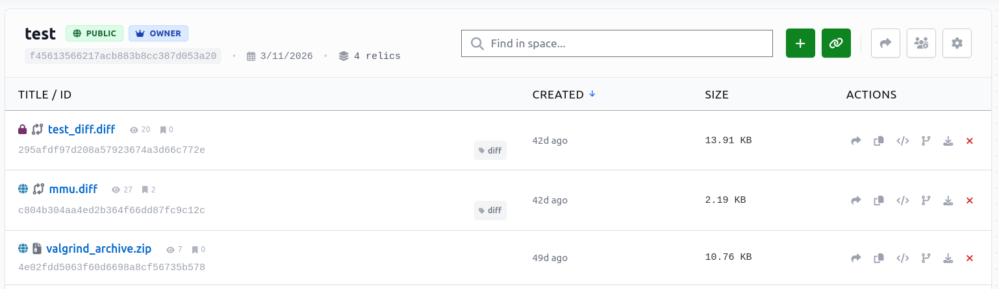
</details>

<details>
<summary><b>💬 Comments</b> — discuss code and artifacts on the relic page</summary>
<br>

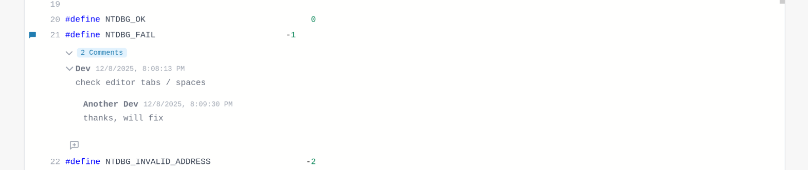
</details>

<details>
<summary><b>🕒 Recent relics</b> — browse public relics or manage your own</summary>
<br>

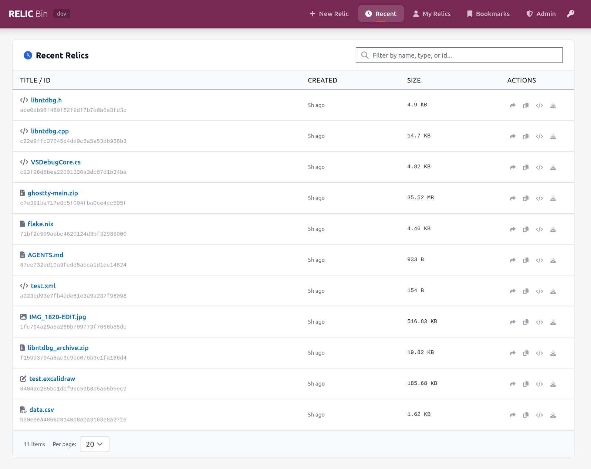
</details>

<details>
<summary><b>🖼️ Image previews</b> — direct rendering with size information</summary>
<br>

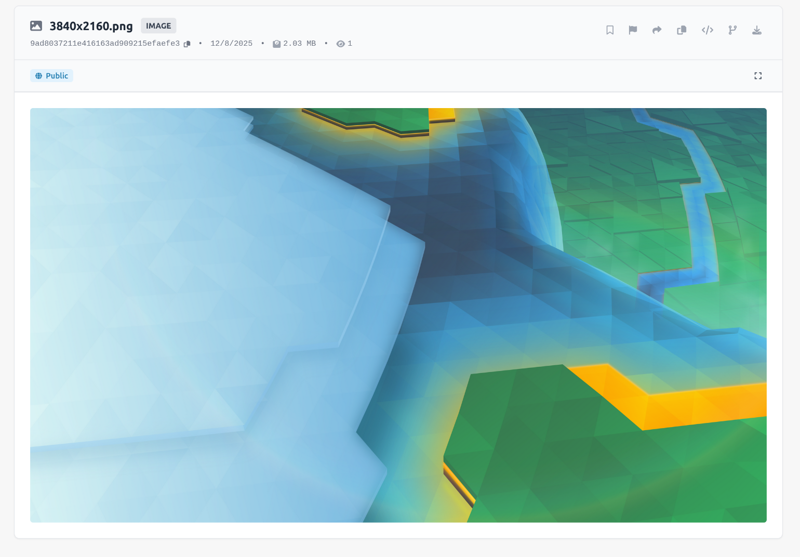
</details>

<details>
<summary><b>🛡️ Admin dashboard</b> — usage, storage, and moderation</summary>
<br>

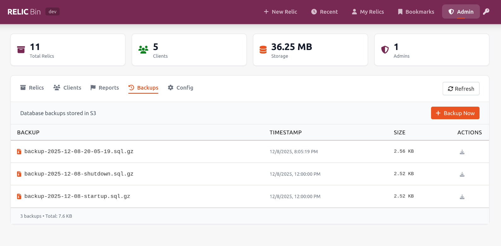
</details>

## ⚡ CLI

Install from your Relic instance (which serves the installer):

```bash
curl -sSL https://your-relic-instance/install.sh | bash
```

Or build from source with Go: `cd cli/client && go build ./cmd/relic`.

```bash
# Upload from stdin
echo "Hello World" | relic

# Upload a file
relic myfile.txt

# Upload with options
relic --name "My Script" --private --expires-in 24h script.py

# Push a relic into a space
relic --space <space_id> script.py

# Fork, inspect, fetch, delete
relic fork <id>
relic info <id>
relic get <id> -o output.txt
relic delete <id>

# Manage spaces
relic spaces create "My Cool Space" --visibility public
```

Run `relic --help` for the full command reference, and `relic init` to configure your default server.

## 🌐 API

All endpoints live under `/api/v1`; interactive OpenAPI docs are served at `/docs`.

| Action | Endpoint |
| --- | --- |
| Create relic | `POST /api/v1/relics` |
| Get metadata | `GET /api/v1/relics/{id}` |
| Raw content | `GET /{id}/raw` |
| Fork | `POST /api/v1/relics/{id}/fork` |
| Delete | `DELETE /api/v1/relics/{id}` |
| List recent public | `GET /api/v1/relics` |

```bash
# Create a relic
curl -X POST http://localhost/api/v1/relics \
  -F "file=@myfile.txt" \
  -F "name=My File"

# Fork it with new content
curl -X POST http://localhost/api/v1/relics/{id}/fork \
  -F "file=@new.txt"
```

## 🚢 Deployment

### Production (prebuilt images)

The [`deploy/`](deploy/) directory contains a ready-to-run Compose file that pulls published images:

```bash
curl -O https://raw.githubusercontent.com/ovidiuvio/relic/main/deploy/docker-compose.yml
docker compose up -d
```

See [`deploy/README.md`](deploy/README.md) for environment configuration, version pinning with `RELIC_VERSION`, and upgrade steps. **Change the default PostgreSQL and MinIO passwords before exposing anything.**

### Production (build from source)

```bash
make up        # docker compose -f docker-compose.prod.yml up -d --build
make logs      # follow logs
make down      # stop services
```

The application is served at http://localhost. (MinIO and PostgreSQL stay internal to the Docker network in this setup; the prebuilt `deploy/` compose additionally publishes the MinIO console on port 9001.)

**Optional S3 backup sync** — not started by default. Fill in the `S3_SYNC_*` variables in `.env`, then:

```bash
docker compose -f docker-compose.prod.yml -f docker-compose.s3-sync.yml up -d --build
```

### Admin setup

Admins can view and delete any relic, manage users, and see system statistics.

1. Get your user ID from the browser console: `localStorage.getItem('relic_user_key')`
2. Set it in the backend environment (comma-separate for multiple admins):
   ```yaml
   backend:
     environment:
       ADMIN_USER_IDS: "5cdb7b79c38385db9f5b5f6ad884c8ef"
   ```
3. Restart (`make down && make up`) — the Admin tab appears in the navigation.

## 🛠️ Development

Hot-reload setup with mounted source volumes for both frontend and backend:

```bash
make dev-up      # start dev stack
make dev-logs    # follow logs
make dev-down    # stop
```

- Frontend: http://localhost (Vite, hot-reload)
- Backend API: http://localhost/api (Uvicorn, auto-reload)
- MinIO console: http://localhost:9001 (minioadmin/minioadmin)

Code changes are picked up immediately — no rebuild needed. See [`CLAUDE.md`](CLAUDE.md) for a map of the codebase and architecture notes.

## 🏗️ Tech Stack

- **Frontend** — Svelte, Tailwind CSS, Vite, Monaco
- **Backend** — FastAPI, SQLAlchemy, Pygments
- **Storage** — PostgreSQL (metadata), MinIO / any S3-compatible store (content)
- **Infrastructure** — Docker, Nginx

## 📄 License

Relic is licensed under the **[MIT License](LICENSE)** — free to use, modify, and self-host for personal or commercial purposes.

<p align="center">
  <sub><code>~ end of file ~</code></sub>
</p>
